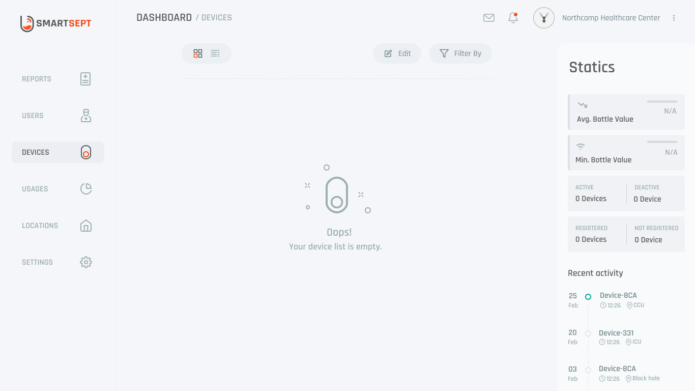
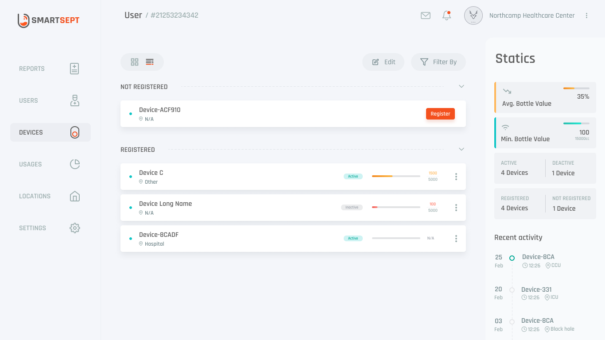
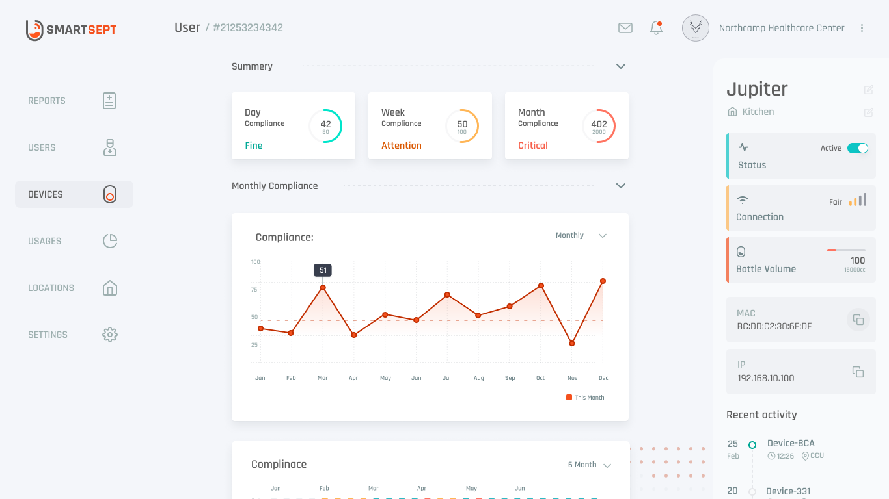
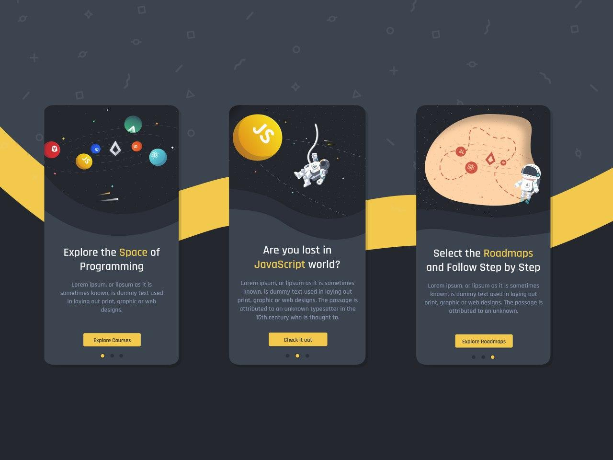
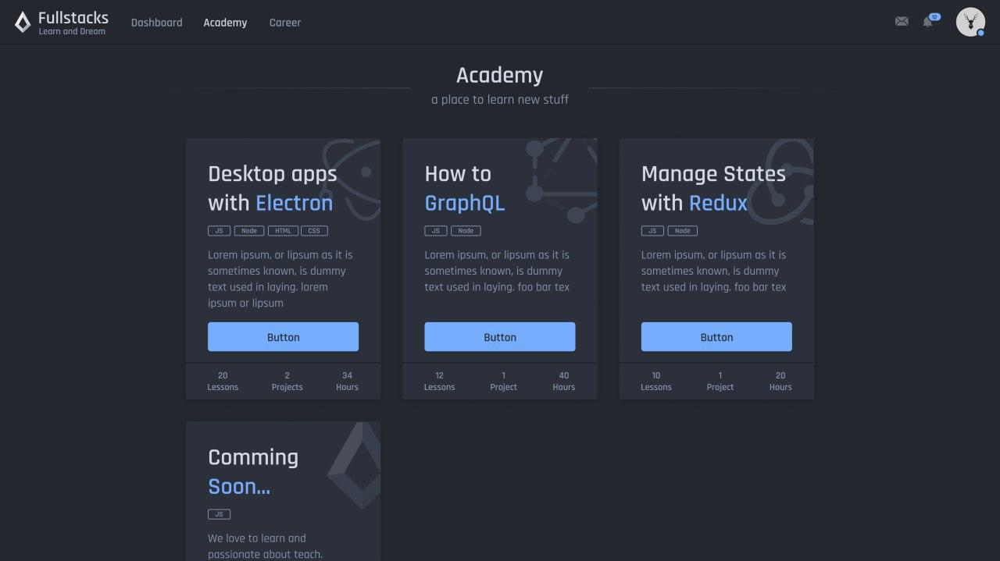
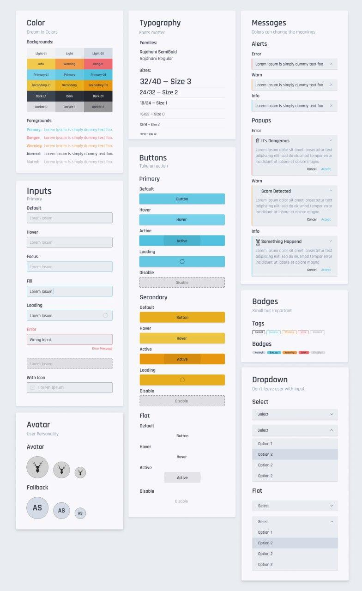

# Designs

## Exploration

Online Platform for hosting programming challenges.

## SmartSept

Realtime monitoring dashboard for IoT devices.

## Dashboard

## Design System

### Charts

### Logo & Boxes

## FullstacksJS

Self-taught programming platform.

### Application

### Design System

## Dropp

Online taxi and food delivery service.

