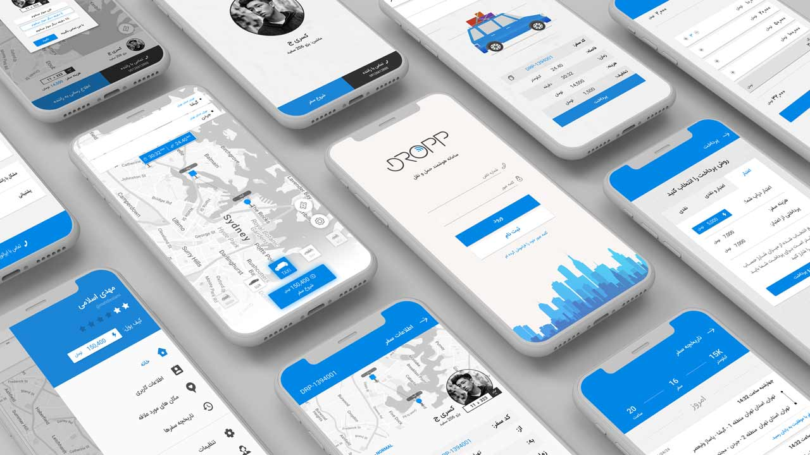
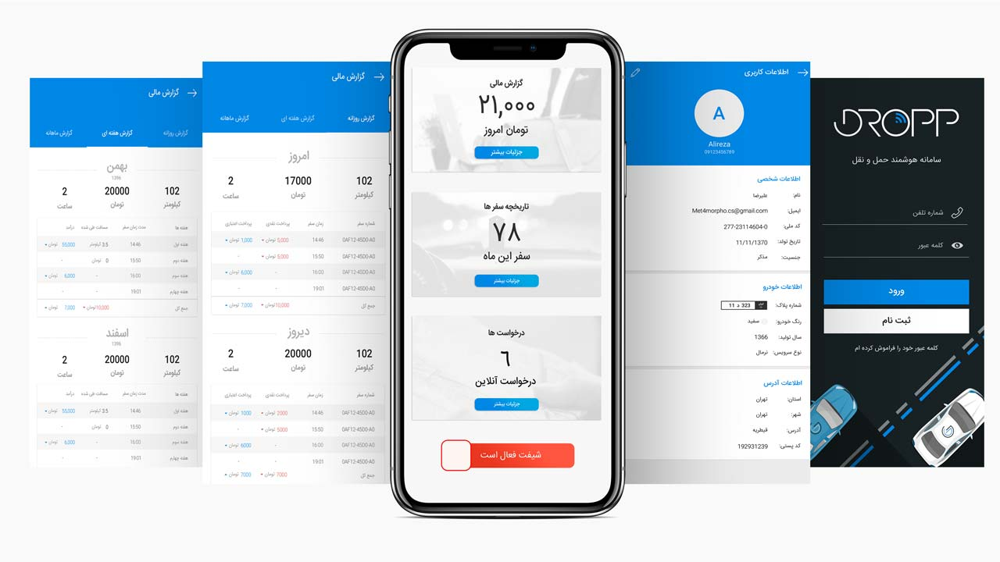
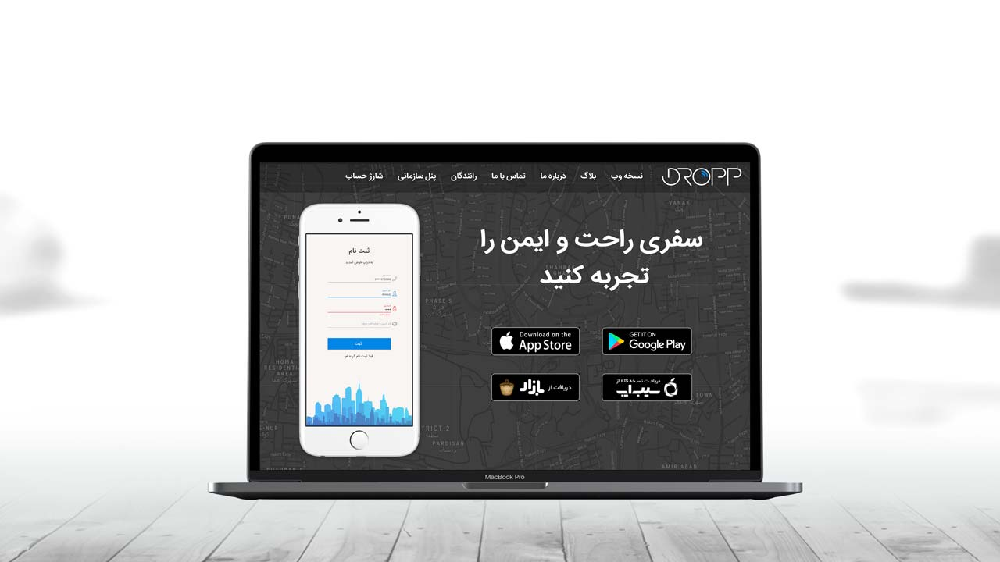

← [Back to Resume](../README.md#lead-frontend-developer--uiux-designer)

<!-- omit in toc -->
# Dropp

<!-- omit in toc -->
## Contents:
- [About](#about)
- [Key Accomplishments](#key-accomplishments)
- [Stack](#stack)
- [Design](#design)

----

## About
↑ [Back to top](#smartsept-app)

An enterprise mobile and web application project.

## Key Accomplishments

* Provides and drives technical improvements for the frontend.
* Provide superior mentoring to frontend developers.
* Performed as a technical lead for the frontend team, code reviews, and production releases.
* Designed and developed the Dropp admin panel and landing page by Angular framework.
* Designed the fullstacks Mobile and application UI, illustrations.

## Stack
↑ [Back to top](#smartsept-app)

* **Design**: Adobe Photoshop, Adobe Illustrator
* **Landing Frontend**: Javascript, Node.JS, Gulp, EJS, SCSS, Nginx
* **Admin Panel Frontend**: Typescript, Angular, SCSS, RxJS

## Design

← [Back to Resume](../README.md#lead-frontend-developer--uiux-designer)
