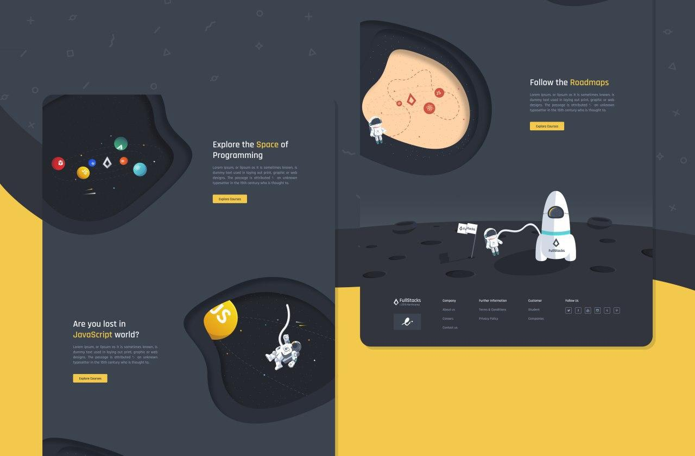
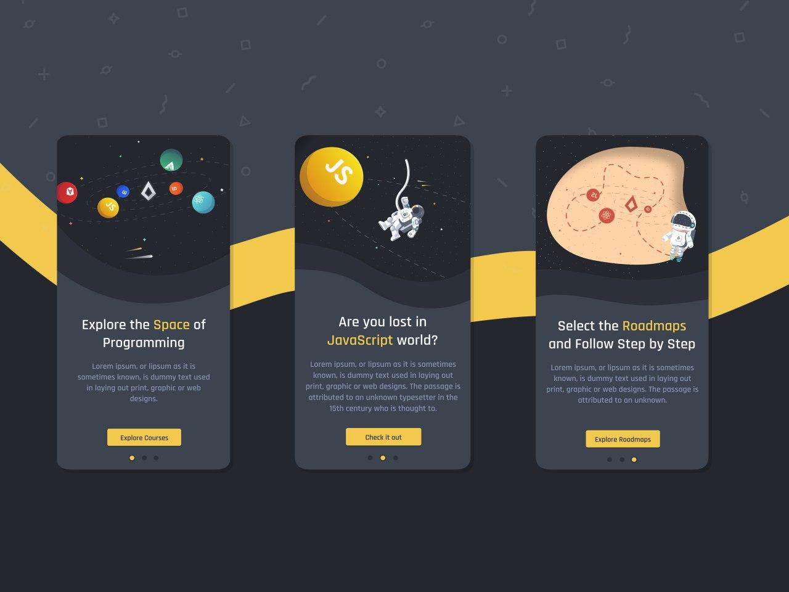
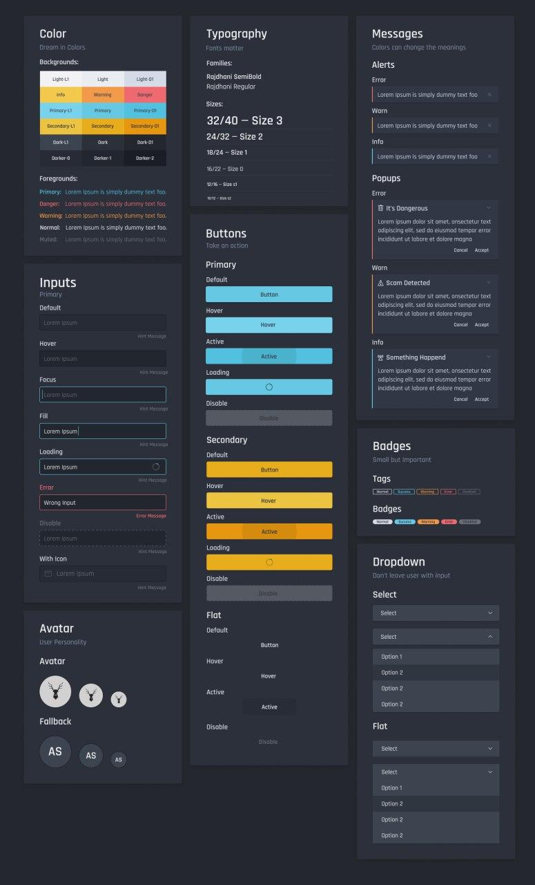
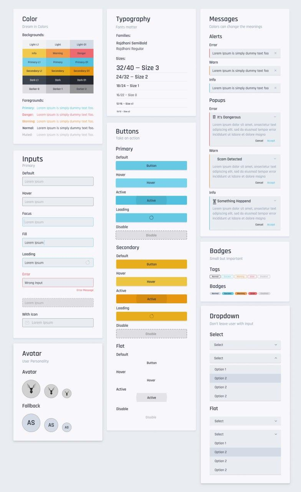
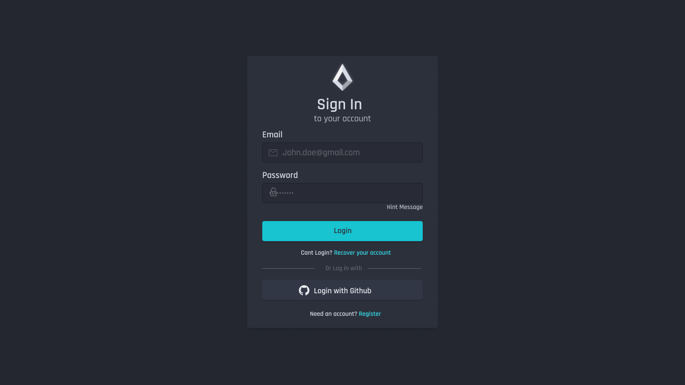
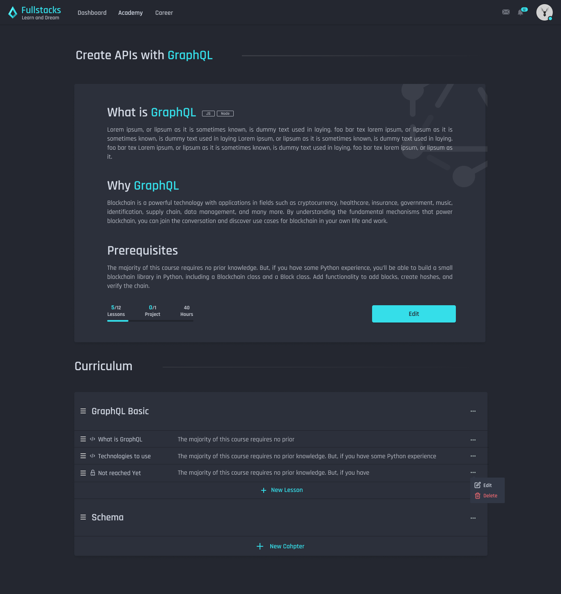
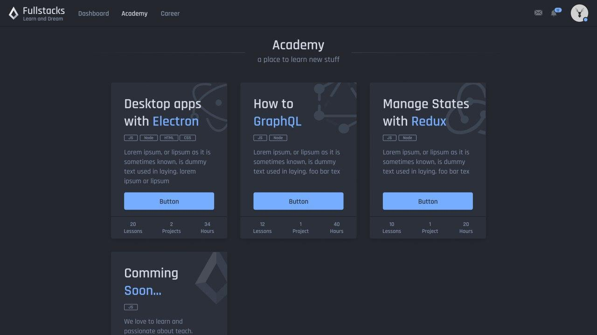
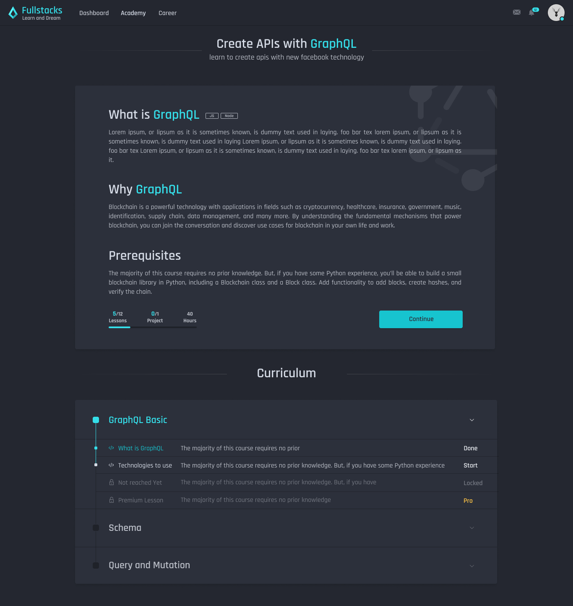
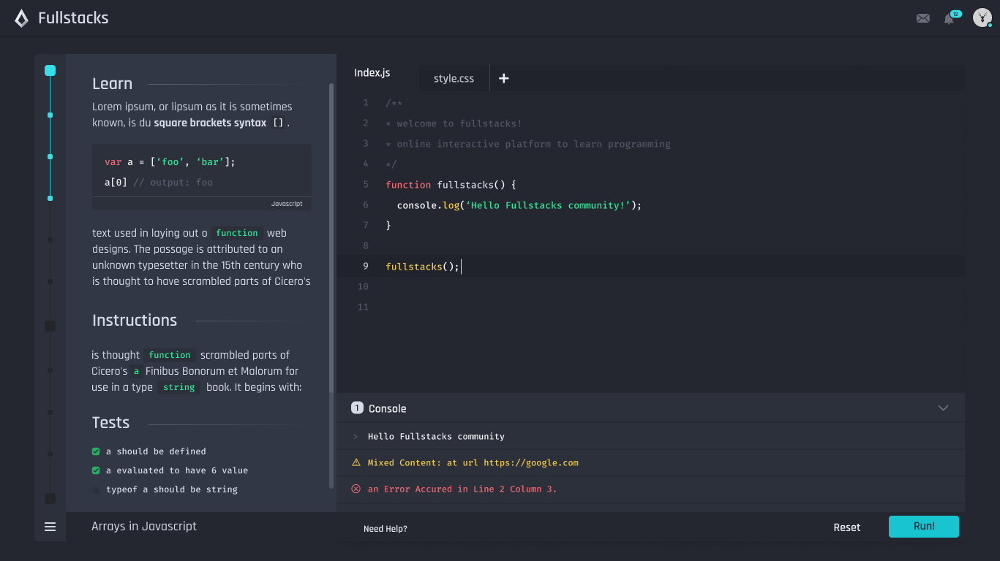
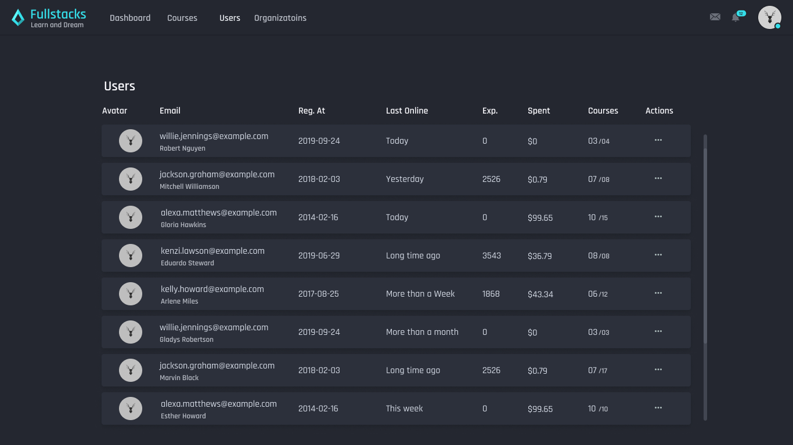

← [Back to Resume](../README.md#mar-2016---now)

<!-- omit in toc -->
# Fullstacks

<!-- omit in toc -->
## Contents:
- [About](#about)
- [Stack](#stack)
- [Design](#design)
- [Implementation](#implementation)

----

## About
An Open-source community and interactive platform for learning how to code.

## Stack
↑ [Back to top](#contents)

* **Design**: Figma, Illustrator
* **Frontend**: Typescript, React, Styled-Components, Apollo Client
* **CodeBox**: Node.JS, Typescript
* **API**: Node.JS, Apollo Server, Typescript, MongoDB, Mongoose, Jest, Nexus

## Design
↑ [Back to top](#contents)

## Implementation
↑ [Back to top](#contents)

---

← [Back to Resume](../README.md#mar-2016---now)
