← [Back to Resume](../README.md#jan-2020---now)
<!-- omit in toc -->
# Smartsept App

<!-- omit in toc -->
## Contents:
- [About](#about)
- [Stack](#stack)
- [UI/UX Design](#uiux-design)
- [Implementation](#implementation)
- [Landing Page](#landing-page)
- [Logo Design](#logo-design)

---

## About
↑ [Back to top](#smartsept-app)

IoT based Hand Hygiene Compliance Monitoring Solution.

An enterprise B2B IOT hand hygiene compliance monitoring project with a highly-motivated and skilled team of software, mechanics, and electronics engineers.

## Stack
↑ [Back to top](#smartsept-app)

* **Design**: Figma
* **Landing**: Typescript, Gatsby, React, Theme-UI, Docker, NginX
* **Frontend**: Typescript, React, Apollo Client, Theme-UI
* **API**: Typescript, Node.JS, Apollo Server, PostgreSQL, Redis, Jest, Prisma, Nexus
* **IOT Broker**: Typescript, Node.JS, Node, Redis, WS
* **ESP Module**: C++, Arduino
* **DevOps**: Docker, NginX

---

## UI/UX Design
↑ [Back to top](#smartsept-app)

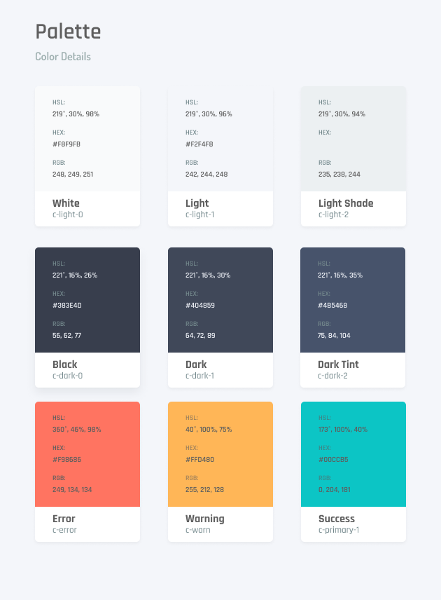

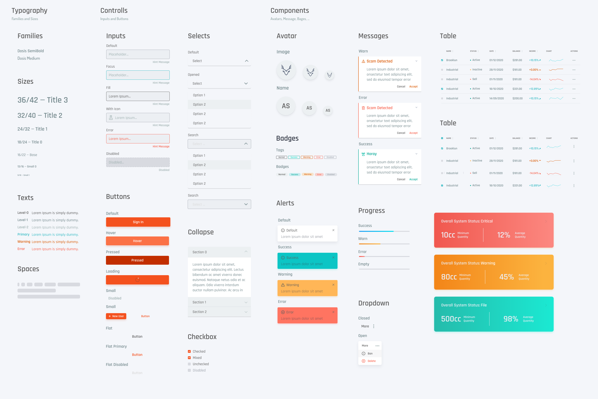

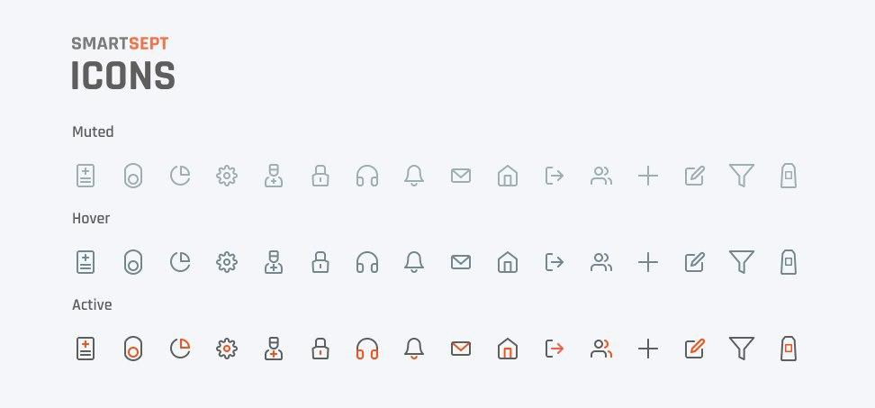

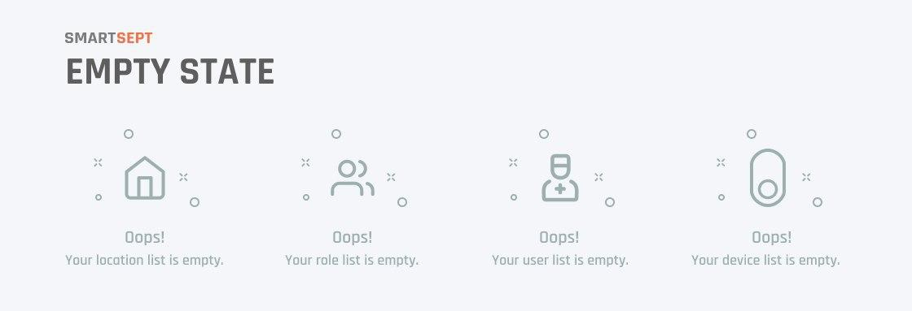

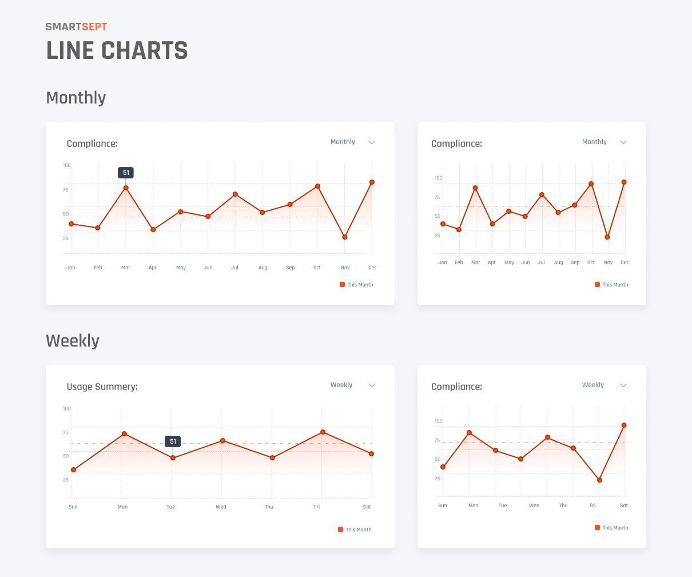

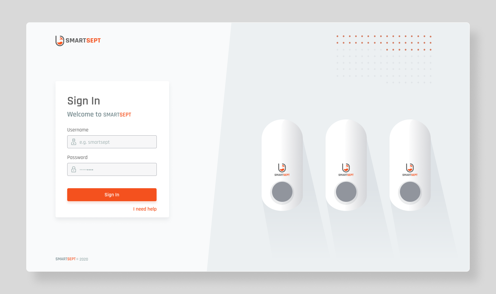

## Implementation
↑ [Back to top](#smartsept-app)

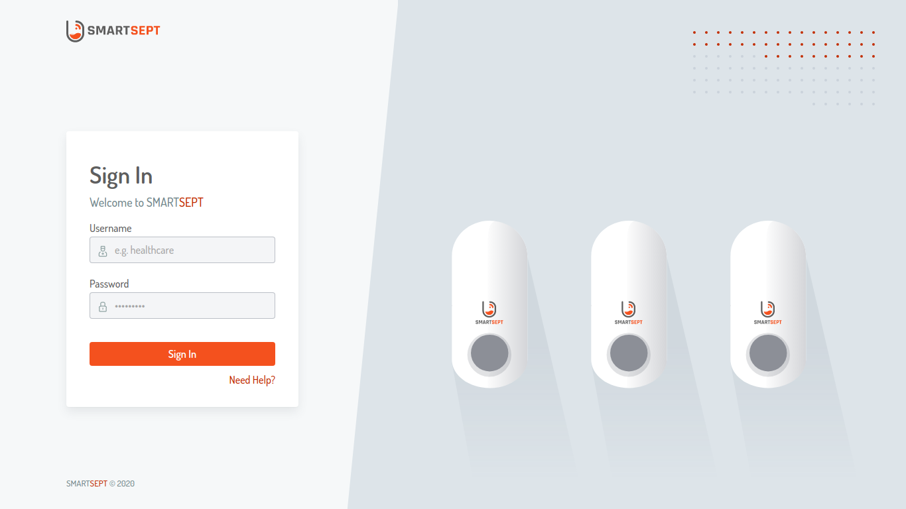

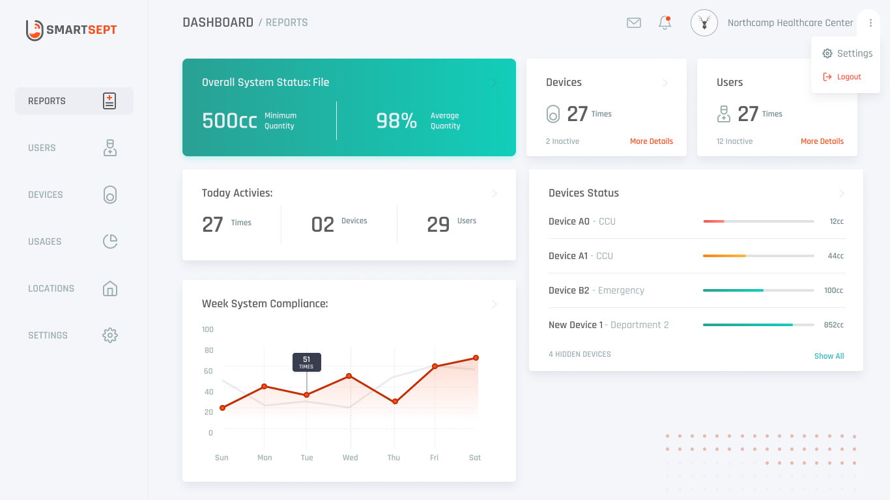

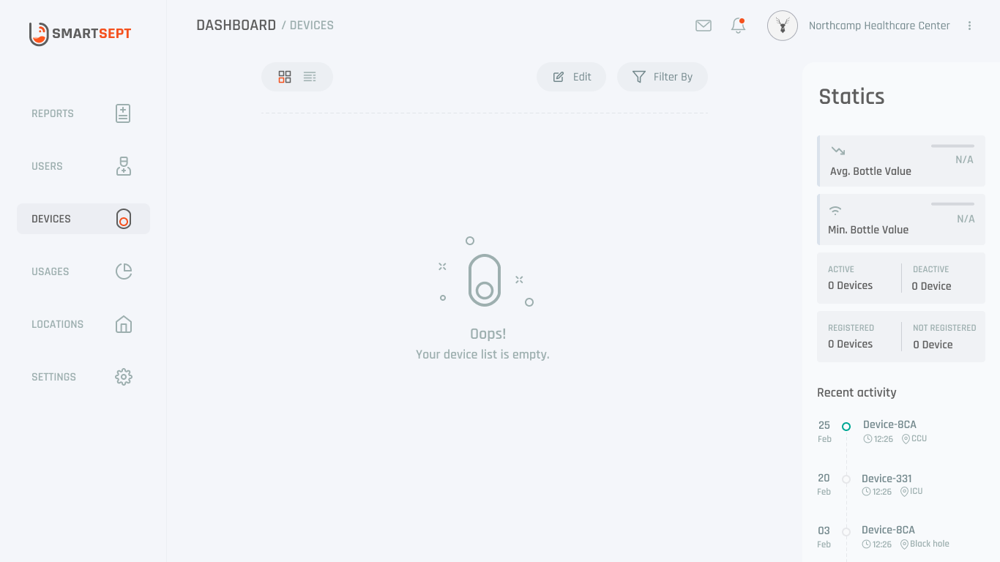

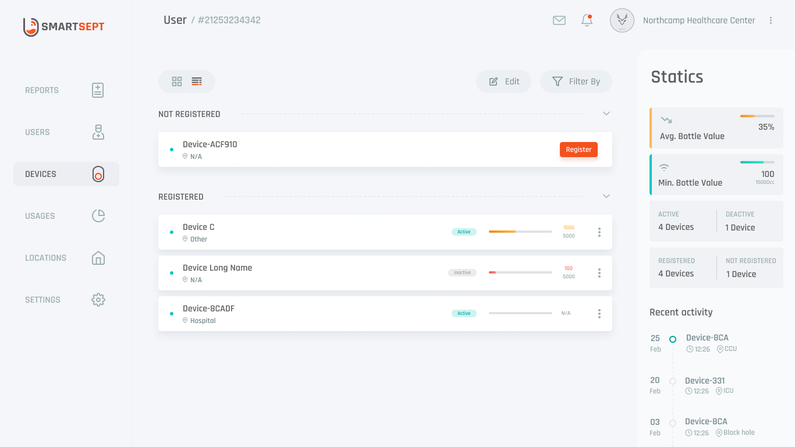

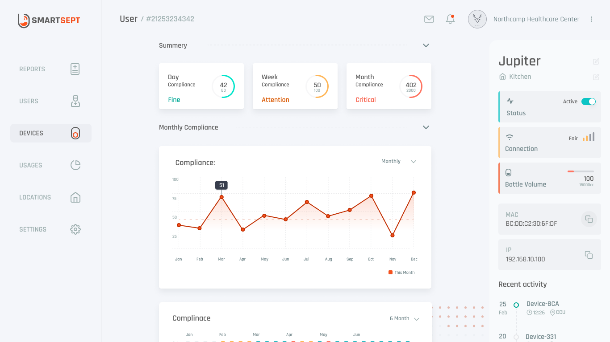

## Landing Page
↑ [Back to top](#smartsept-app)

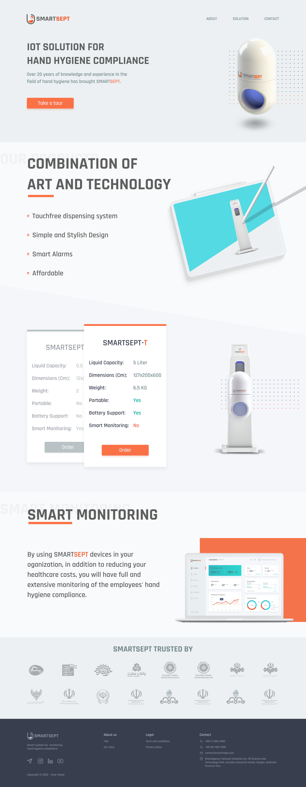

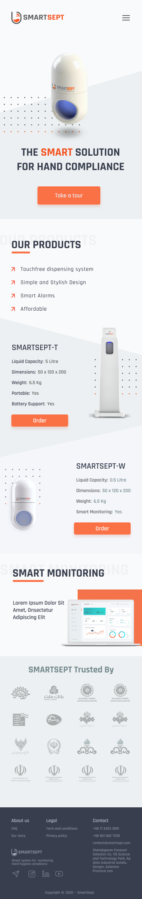

## Logo Design
↑ [Back to top](#smartsept-app)

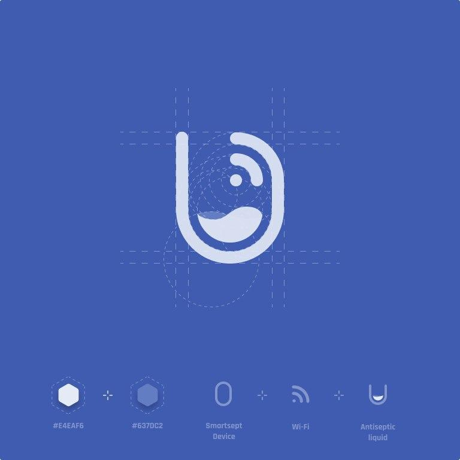

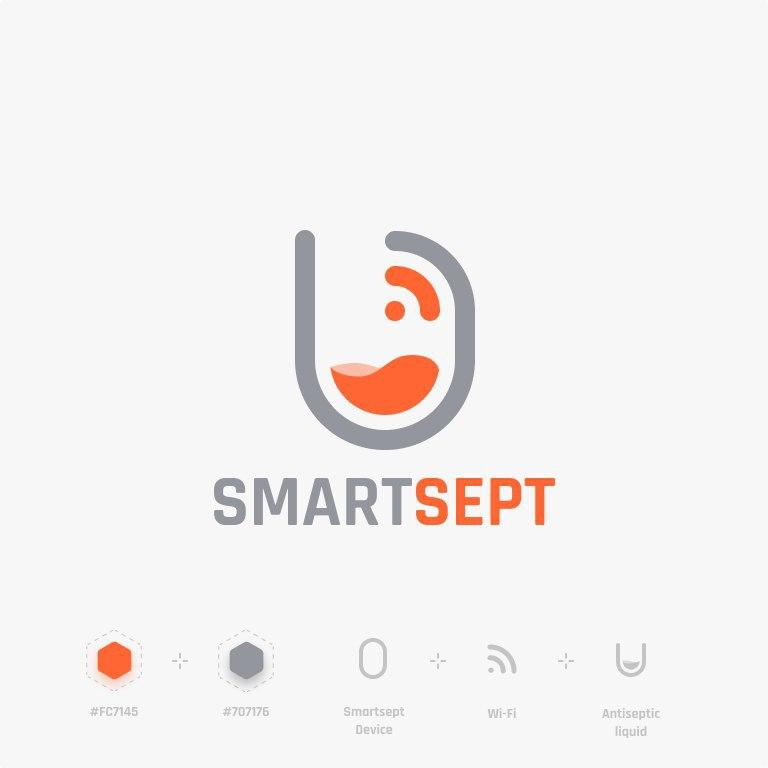

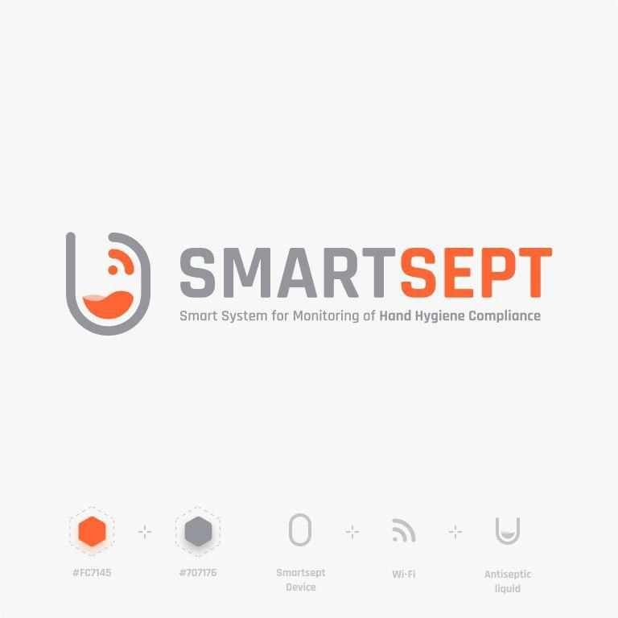

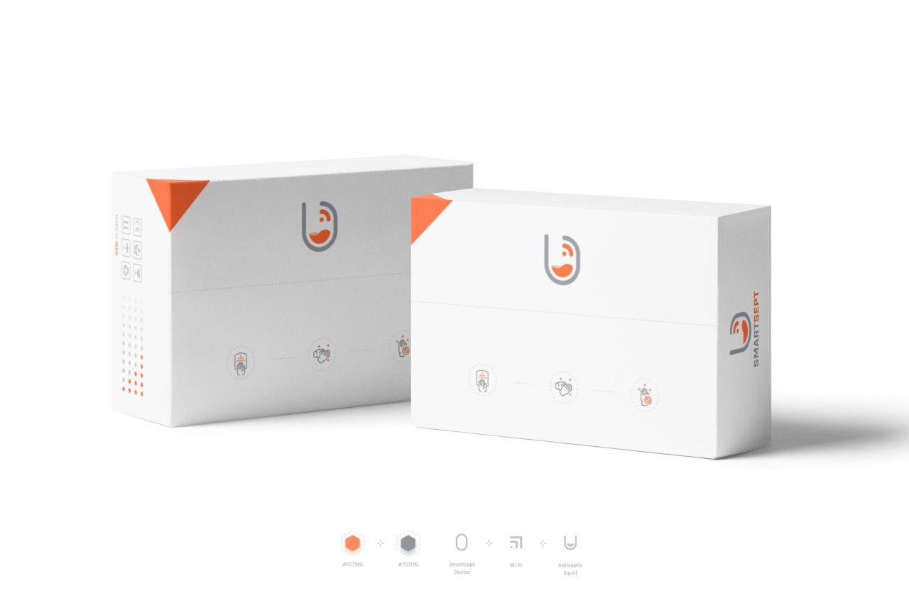

---

← [Back to Resume](../README.md#jan-2020---now)
